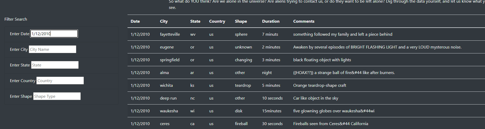
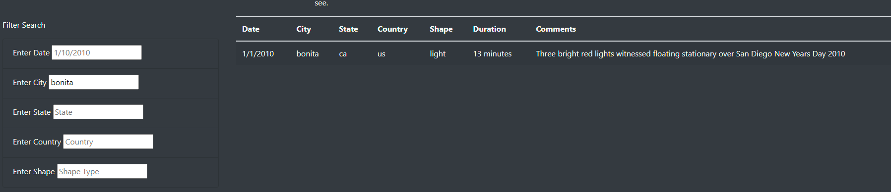
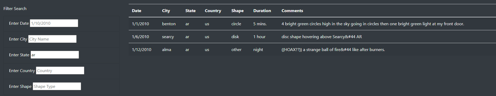
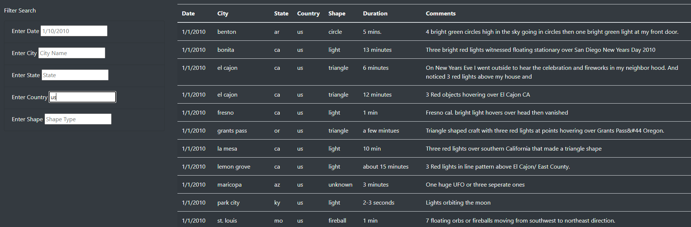
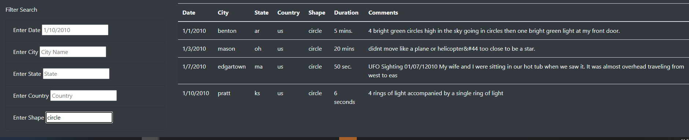

# UFOs

## Overview

The general purpose of this project was to create a dynamic table that we could filter in categories of date, city, state, country, and shape time for UFO sightings listed in our database. The purpose was to be able to allow our users to quickly and efficiently filter through our data to see different locations and types of UFOs that we were reporting on our website.

## Results

Search process is incredibly simple. The code is designed to automatically filter through the data set after you finish typing and click away from the box or press enter. The website utilizes a text search filter function as utilized in our app.JS file to quickly cipher through all the different data points and assembles the table with the filter data in tow. This is accomplished by utilizing two functions. The first function creates a set of variables in order to assign the filters based on the element we present in our filter table. The second filter utilizes an object/forEach function to go through our table data and utilize the updated filter function to parse that data into our table. This quickly updates the HTML file and displays what the user would like to see as soon as possible. Here are examples of the filter working below:

Filtering by Date:

Filtering by City:

Filtering by State:

Filtering by Country:

Filtering by Shape:

## Summary

Intern we can very easily cipher through the data set if need be. However there’s a really big downside and that is the usability of the website from a user-friendly standpoint. The filter does not like to function if the data that is being typed into the filter does not specifically match the formatting of the data. Such as if you were to type in Arizona instead of ar you would not get a search result back, and in turn will get a blank table. If a user does not understand the blank table is an error on the filters part, they could assume that whatever data point they were trying to type in there does not exist on our site versus them not typing in the data exactly right. So my first recommendation for that would be to optimize the code to allow for the data set to be filtered no matter what shows up. I would allow it to be search optimize so that if someone were to type in any format of data, The data could parse through and decide whether that’s either an abbreviation or a different variation of something that’s on the website. Secondly, this is a UFO website, where we are experiencing and understanding the facts and sightings of UFOs. While this website is supposed to be testimonials by UFOlogists, there should be some sort of user submission form or forum for people to submit their experiences. This would allow us to grow our data file and user base by allowing people to discuss more in depth about what they’ve seen personally versus just a small data table that we have. And finally actually I would add onto that that there should also be a discussion board for said posts so people can argue the validity of their statements.
